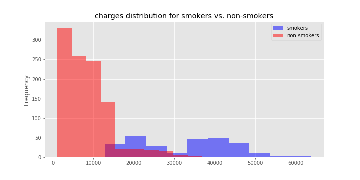

## EDA + Linear Regression

In this repository we are going to explore a small dataset of smokers vs. non smokers basically the dataset is based on patients hospital records. we will explore various factors and correlations associated with smoking and hospital charges.

In the last section we will predict hospital bill charges based on different factors using Linear Regression.

Here is the summary of Dataset:

| age  | sex    | bmi    | children | smoker | region    | charges     |
| ---- | ------ | ------ | -------- | ------ | --------- | ----------- |
| 19   | female | 27.9   | 0        | yes    | southwest | 16884.924   |
| 18   | male   | 33.77  | 1        | no     | southeast | 1725.5523   |
| 28   | male   | 33     | 3        | no     | southeast | 4449.462    |
| 33   | male   | 22.705 | 0        | no     | northwest | 21984.47061 |
| 32   | male   | 28.88  | 0        | no     | northwest | 3866.8552   |

As some of the columns are categorical in nature we will be required to encode them will label encoders.

To get started see the [notebook](EDA_LinearRegression.ipynb)

**Here are some of the initial Exploratory Data Analysis**

1. correlations between different factors

2. Hospital charges distribution

   

3. Population Distribution

   

many more to add on...